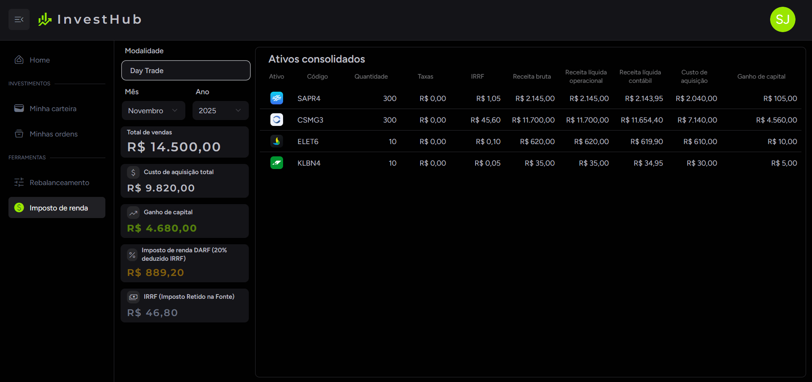

# 📈 INVESTHUB

O **InvestHub** é um sistema para controle, análise e planejamento de carteira de investimentos em ações.  
Com ele, você pode registrar suas negociações de compra e venda, acompanhar a rentabilidade dos seus ativos em tempo real e planejar a composição ideal da sua carteira.

As cotações são obtidas automaticamente através da **API BRAPI**, permitindo que a visualização de dados financeiros seja sempre atualizada.

---

## 🚀 Funcionalidades Principais

### 🧾 Controle de Ordens
- Registrar novas ordens de **compra** ou **venda**.
- Editar ordens existentes.
- Excluir ordens.
- Histórico completo de transações.

### 💼 Visualização da Carteira Atual
Para cada ativo da carteira, o sistema exibe:
- **Logo** e **símbolo** do ativo.
- **Quantidade total** de ações.
- **Preço médio** de compra.
- **Cotação atual (tempo real via BRAPI)**.
- **Rentabilidade** (absoluta e percentual).

### 🎯 Planejamento da Carteira
- Monte uma **carteira planejada** com os ativos desejados.
- Compare **carteira atual vs. planejada**.
- Veja **percentual de alocação recomendado** vs. **percentual atual**.
- Sistema calcula automaticamente **diferenças e ajustes necessários**.

### 🧮 Cálculo Automático de Imposto de Renda
- Cálculo automático do **ganho líquido** nas vendas.
- Considera histórico de compra e venda.
- Calcula **IR a pagar** segundo regras da Receita Federal para as modalidades Day Trade e Swing Trade:
  - Isenção de vendas abaixo de R$ 20.000 no mês para a modalidade Swing Trade.
  - Cálculo automático de Imposto de Renda Retido na Fonte (IRRF)
  - Descontos de taxas e prejuízos acumulados.

---

## 🛠️ Tecnologias Utilizadas

| Tecnologia | Finalidade |
|----------|------------|
| React / Vite | Interface do usuário e fluxo de navegação |
| TypeScript | Tipagem e maior segurança no código |
| TailwindCSS | Estilização |
| API BRAPI | Obtenção das cotações em tempo real |
| Node.js / Backend | Processamento e persistência de dados |
| Banco de Dados PostgreSQL | Armazenamento das ordens e configurações |

---

## 📷 Capturas de Tela (opcional)



---

## ⚙️ Como Executar o Projeto

```bash
# Clone o repositório
git clone https://github.com/seu-usuario/investhub.git

# Acesse o diretório
cd investhub

# Instale as dependências
npm install

# Execute o projeto
npm run dev
